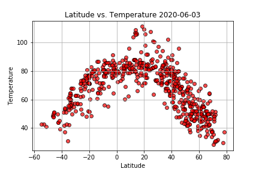
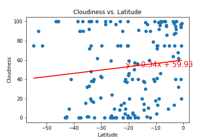
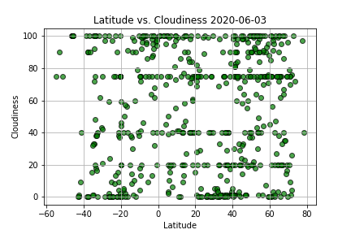
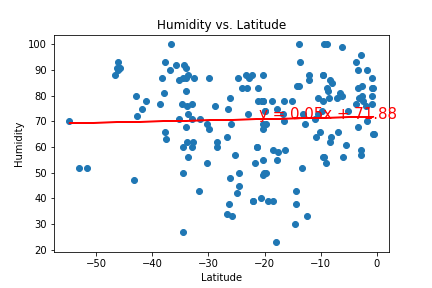
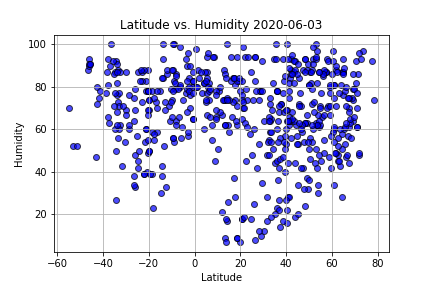

# python-api-challenge

Weather data was collected from more than 500 cities generated from randomly selected latitude and longitude coordinates.  Relationships between latitude and temperature, humidity, cloudiness, and wind speed were analyzed. From these results, the list was restricted by pre-determined "ideal" weather conitions.  From the reduced data set of cities with ideal weather conditions, the nearest hotels were found and mapped.

Weather Analysis and Observations:

* With a moderate correlation between temperature and latitude, you are generally more likely to experience warmer temperatures near the equator.
* Humidity, cloudiness, and wind speeds have no relationship to latitude with r-squared values at or very near zero.
* Southern hemisphere temperatures are directly proportional to latitude and norhtern hemisphere temperatures are inversely proportional to latitude. As latitude increases, temperature increases if you are in the southern hemisphere. As latitude decreases, temperature increases if you are in the northern hemisphere.
* Peak temperatures occur at 20 degrees north of the equator. Looking at seasonal data would be interesting to investgate the impact of the tilting of the Earth on its axis with respect to the latitude of peak temperatures in different seasons.

